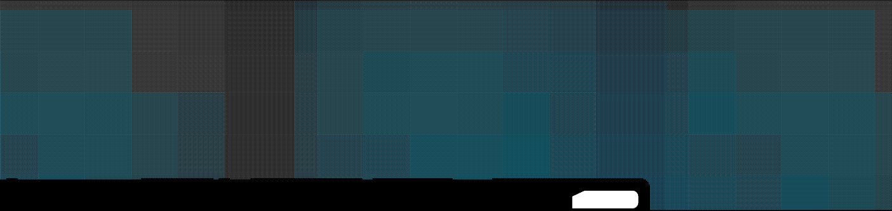
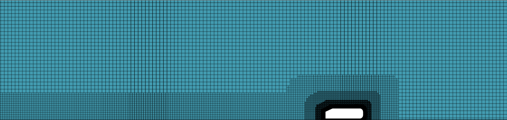
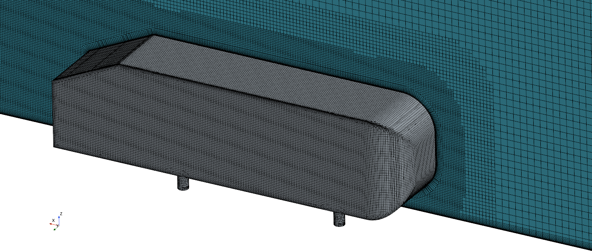
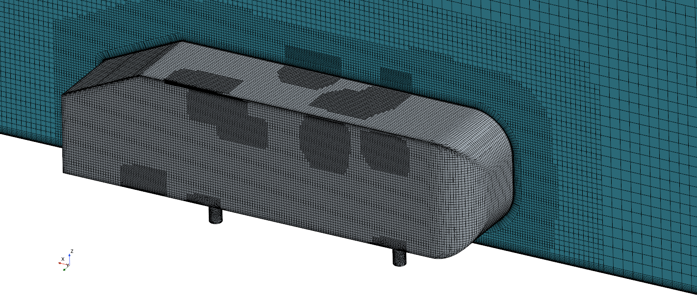

```{r setup}
#| echo: false
library("ggplot2")
library("scales")
```

```{r functions}
#| echo: false

ReadDataClean <- function(path) {
  x <- read.csv(path)
  x <- x[which(x$Error == " N/A " & x$Comment == " N/A"), ]
}
```

# Introduction

One of the most time-consuming parts of FSAE is the endless simulations you must do in order to predict how certain parts of the car will behave, and no sub team does more simulations than the aerodynamics sub team. Any time you make any minute change to a single aerodynamic part you run a CFD on it to get an estimate of the aerodynamics of the part, and if its not up to par you edit the part and try again. This is an extremely time consuming process, as not only do parts go through countless iterations, but the actual simulation time for one part can take upwards of 5 hours depending on the complexity, which is far from ideal.

As such, we want to figure out how to reduce the times we take to simulate a single part by as much as possible, which we will accomplish through the analysis of an Ahmed Body. To briefly explain what an Ahmed Body is: it is 

# Simulation Setup

# Benchmark Simulation

# Optimizing Meshing

```{r read_mesh_csv}
#| echo: false

## Base 300
Base300 <- ReadDataClean("/home/ksodlehe/Programming/Star/Ahmed-Analysis/Summaries/Meshing/Base 300.csv")
## Base 200
Base200 <- ReadDataClean("/home/ksodlehe/Programming/Star/Ahmed-Analysis/Summaries/Meshing/Base 200.csv")
## Base 100
Base100 <- ReadDataClean("/home/ksodlehe/Programming/Star/Ahmed-Analysis/Summaries/Meshing/Base 100.csv")
## Base 50
Base50 <- ReadDataClean("/home/ksodlehe/Programming/Star/Ahmed-Analysis/Summaries/Meshing/Base 50.csv")
## Base 40
Base40 <- ReadDataClean("/home/ksodlehe/Programming/Star/Ahmed-Analysis/Summaries/Meshing/Base 40.csv")
## Base 30
Base30 <- ReadDataClean("/home/ksodlehe/Programming/Star/Ahmed-Analysis/Summaries/Meshing/Base 30.csv")

BaseData <- rbind(Base300, Base200, Base100, Base50, Base40, Base30)
```

## Optimal base and ahmed body cell sizes
```{r #fig-base_and_ahmed}
#| echo: false
#| fig-align: "center"
#| fig-width: 7
#| fig-height: 6
#| fig-cap: "Convergence of Base and Ahmed Body Target Cell Sizes towards lower Drag Coefficient Errors"

AhmedTarget <- paste(formatC(as.numeric(gsub("mm|( )","",trimws(BaseData$Ahmed.Target.Size))),width = 2, format = "d", flag = "0"), "mm")
Error <- 100*(BaseData$cd.A.../0.285 - 1)
Cells <- BaseData$Cell.Count
Base <- paste("Base =",formatC(as.numeric(gsub("mm|( )","",trimws(BaseData$Mesh.Base))),width = 3, format = "d", flag = "0"), "mm")

df <- data.frame(Base, AhmedTarget, Error, Cells)

ggplot(df, aes(x=Cells, y=Error)) +
  geom_line(aes(color = AhmedTarget),
            linewidth = 1) +
  scale_x_continuous(labels = scientific,
  breaks = c(4*10^6,7*10^6,10*10^6)) +
  labs(y = "Drag Coefficient Error (%)",
       x = "Cell Count",
       color = "Ahmed Body\nTarget Cell\nSize") +
  theme(plot.title = element_text(size = 12),
        axis.title = element_text(size = 10),
        legend.text = element_text(size = 8.5),
        legend.title = element_text(size = 10)) +
  facet_wrap(~Base, nrow = 3)
```

From this graph it is apparent that larger base sizes are less chaotic than smaller sizes, making them much better for the purposes of FSAE. Furthermore, a smaller Ahmed target size consistently results in lower drag coefficient errors. Due to this, for all future parameter iterations we will use **Base = 300mm** and **Ahmed Target Size = 5mm**.

s
## Optimal target cell size


# Optimizing Tunnel Offsets
```{r #fig-tunnel_back_offset}
#| echo: false
#| fig-width: 7
#| fig-cap: "Effect of Increasing Front Offsets on the Drag Coefficient Error"

Front <- ReadDataClean("/home/ksodlehe/Programming/Star/Ahmed-Analysis/Summaries/Tunnel/Front Increase.csv")
Error <- 100*(Front$cd.A.../0.285 - 1)
BackOff <- paste0("Back Offset = ", Front$Back.Offset)
FrontOff <- as.numeric(gsub("m|( )","",trimws(Front$Front.Offset)))

df <- data.frame(Error, FrontOff, BackOff)

ggplot(df, aes(x = FrontOff, y = Error, group = BackOff)) +
  geom_line() +
  scale_x_continuous(breaks = pretty_breaks(n=3)) +
  labs(y = "Drag Coefficient Error (%)",
       x = "Front Offset (m)") +
  theme(plot.title = element_text(size = 12),
        axis.title = element_text(size = 10),
        legend.text = element_text(size = 8.5),
        legend.title = element_text(size = 10)) +
  facet_wrap(~BackOff, nrow = 3)
```

```{r #fig-tunnel_front_offset}
#| echo: false
#| fig-width: 7
#| fig-cap: "Effect of Increasing Back Offsets on the Drag Coefficient Error"

Back <- ReadDataClean("/home/ksodlehe/Programming/Star/Ahmed-Analysis/Summaries/Tunnel/Back Increase.csv")
Error <- 100*(Back$cd.A.../0.285 - 1)
FrontOff <- paste0("Front Offset = ", Back$Front.Offset)
BackOff <- as.numeric(gsub("m|( )","",trimws(Back$Back.Offset)))

df <- data.frame(Error, FrontOff, BackOff)

ggplot(df, aes(x = BackOff, y = Error, group = FrontOff)) +
  geom_line() +
  scale_x_continuous(breaks = pretty_breaks(n=3)) +
  labs(y = "Drag Coefficient Error (%)",
       x = "Front Offset (m)") +
  theme(plot.title = element_text(size = 12),
        axis.title = element_text(size = 10),
        legend.text = element_text(size = 8.5),
        legend.title = element_text(size = 10)) +
  facet_wrap(~FrontOff, nrow = 3)
```

# gabagoo

::: {#fig-tunnel_mesh layout-nrow="2"}
{#fig-bench_mesh}

{#fig-refined_mesh}

Tunnel meshing differences
:::

::: {#fig-body_mesh layout-ncol="2"}
{#fig-benchmark_ahmed}

{#fig-refined_ahmed}

Ahmed body meshing differences
:::
Humorously, the benchmark mesh is so fine that it actually creates Moiré Patterns with computer monitors, which goes to show just how inefficient the benchmark truly was. [@Ahmed] [@Campen] \newpage
